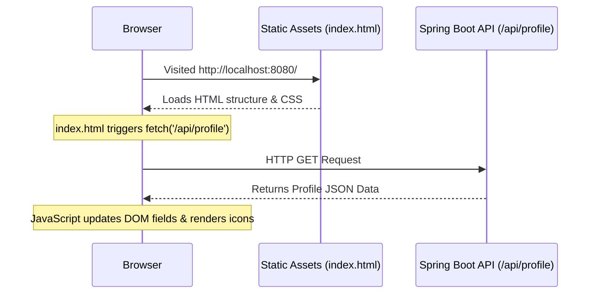

# Profile Feature Documentation

This document explains the architecture, structure, syntax, and connection flow for the Profile page of the Resume/Portfolio web application.

---

## 1. Feature Overview
The profile feature displays your bio, contact information, social handles, and personal profile image. It is structured using the **Package-by-Feature** architecture to ensure modularity, separating its logic cleanly from other upcoming features (like Education, Experience, or Projects).

---

## 2. Directory Structure

The files associated with this feature are distributed across the backend Java package and the frontend static assets:

```text
Renz Mapa - Resume/
├── src/main/java/com/renzmapa/resume_api/
│   ├── config/
│   │   └── WebConfig.java               # Configures path prefixes dynamically
│   └── profile/
│       ├── Profile.java                 # Java record defining the Profile data model
│       └── ProfileController.java       # Rest controller serving profile JSON
│
└── src/main/resources/static/
    ├── index.html                       # HTML structure for the profile UI
    ├── css/
    │   ├── global.css                   # Shared styles (variables, reset, body, backgrounds)
    │   └── profile.css                  # Specific styles (profile card, glows, animations)
    └── images/
        └── avatar.png                   # Professional 3D developer avatar image
```

---

## 3. Backend Logic & Syntax

### The Data Model (`Profile.java`)
We define the structure of our profile using a Java **`record`**:
```java
public record Profile(
    String name,
    String title,
    String email,
    String phone,
    String location,
    String bio,
    List<String> socialLinks
) {}
```
* **Why use a Record?** Java records are immutable classes introduced to model data. They automatically generate constructors, getters, `equals()`, `hashCode()`, and `toString()` at compile time, eliminating verbose boilerplate code.

### The REST Controller (`ProfileController.java`)
This class exposes a JSON endpoint for the profile data:
```java
@RestController
@RequestMapping("/profile")
public class ProfileController {
    @GetMapping
    public Profile getProfile() { ... }
}
```
* **`@RestController`**: Tells Spring Boot that this class handles web requests and automatically serializes the returned `Profile` record into a JSON payload.
* **`@RequestMapping("/profile")`**: Maps requests arriving at `/profile` to this class.
* **`@GetMapping`**: Binds HTTP `GET` requests to the `getProfile()` method.

### Dynamic Routing Prefixing (`WebConfig.java`)
To maintain consistency and keep our code clean, we automatically prefix REST controllers with `/api`:
```java
@Configuration
public class WebConfig implements WebMvcConfigurer {
    @Override
    public void configurePathMatch(PathMatchConfigurer configurer) {
        configurer.addPathPrefix("/api", 
            HandlerTypePredicate.forAnnotation(RestController.class)
        );
    }
}
```
* **How it connects:** Rather than typing `/api/profile` manually on every API controller, this configuration inspects all classes in the app. If a class has the `@RestController` annotation, Spring automatically prefixes its routes with `/api`.
* **Benefit:** Controllers serving HTML pages (`@Controller`) will not get this prefix, allowing you to access them directly without `/api` at the start.

---

## 4. Frontend Integration & Connection Flow

The client-side UI retrieves the profile dynamically using standard Web APIs.



### Fetching the Data
Inside [index.html](file:///c:/Users/Renz/Personal%20Projects/Renz%20Mapa%20-%20Resume/src/main/resources/static/index.html), we perform a dynamic async fetch request:
```javascript
fetch('/api/profile')
    .then(response => response.json())
    .then(data => {
        // Populates elements:
        document.getElementById('name').textContent = data.name;
        document.getElementById('title').textContent = data.title;
        // ... updates remaining text nodes
    });
```
1. **Trigger**: When a user accesses the root domain, the page loads and executes the Javascript fetch call to `/api/profile`.
2. **Parsing**: The JSON response returned by our Spring Boot `ProfileController` is converted into a Javascript object.
3. **DOM Injection**: We update target HTML elements dynamically (`document.getElementById().textContent`) to show your real data instantly without reloading the page.
